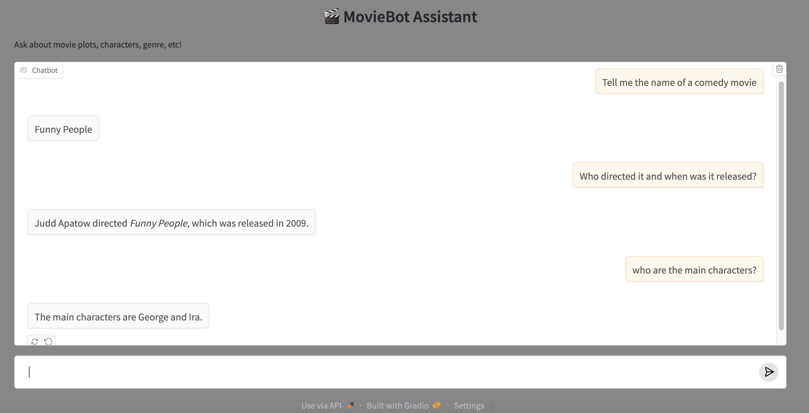

# 🎬 MovieBot

An intelligent movie assistant chatbot powered by a local LLM and real-world data from **Wikipedia**.

The dataset can be downloaded from [Kaggle's Wikipedia Movie Plots dataset](https://www.kaggle.com/datasets/jrobischon/wikipedia-movie-plots).


---

## Objective

MovieBot is an assistant bot that uses real movie plot data sourced from Wikipedia to answer user questions conversationally. 

It demonstrates how Retrieval-Augmented Generation (RAG) can be used with local LLMs to build intelligent assistants. Similar techniques can be applied to build customer service bots or domain-specific AI helpers.

---

## Implementation

This assistant is built using:

- **Langchain** – for building RAG pipelines and memory handling.
- **Ollama** – for running local LLMs easily.
- **Gemma 2 (9B)** – a local open-source LLM used for generating responses.
- **FAISS** – for fast vector search and retrieval of relevant documents.
- **HuggingFace Embeddings** – to convert texts into vector representations.
- **Conversational Memory** – preserves the history of the conversation for contextual continuity.
- **Gradio** - provides an interactive user interface to chat with the bot.

The dataset is preprocessed from Wikipedia’s movie plot summaries, chunked, embedded, and indexed locally using FAISS for efficient retrieval.

Since the dataset is too large, only the movies released after 1990 are considered in this project (the dataset includes data up to the year 2017).

---

## Running
1. Dowload the Wikipedia csv dataset from the provided link and put it in data directory.
2. Create a python environment and install the dependencies:
    ```bash
    pip install -r requirements.txt
    ```
3. Install `Ollama` and download `gemma2:9b` LLM as explained in the last section of this README file.

4. Run the chatbot:
    ```bash
    python main.py
    ```

Start chatting with your assistant!

*Note:* creating the Faiss index for document retrieval takes some minutes (10 to 15) during the first run. It will be saved and loaded automatically in subsequent runs.

## Example Output



## Ollama Installation

### Mac
```bash
brew install ollama
```

### Linux
```bash
curl -sSL https://ollama.com/install.sh | bash
```

### Downloading Models
To download a specific model (the list of all supported models is available at [ollama.com/search](https://ollama.com/search)):
```bash
ollama pull gemma2:9b
```
The model will be downloaded and saved in `~/.ollama`

### List of Downloaded Models
To show the list of downloaded models:
```bash
ollama list
```

If it doesn't list anything, try these commands on Mac:
```bash
brew services restart ollama
ollama list
```

### Testing Models
To test the model:
```bash
ollama run gemma2:9b Hello World!
```

### Removing Models
To delete a downloaded model:
```bash
ollama rm <model-name>
```